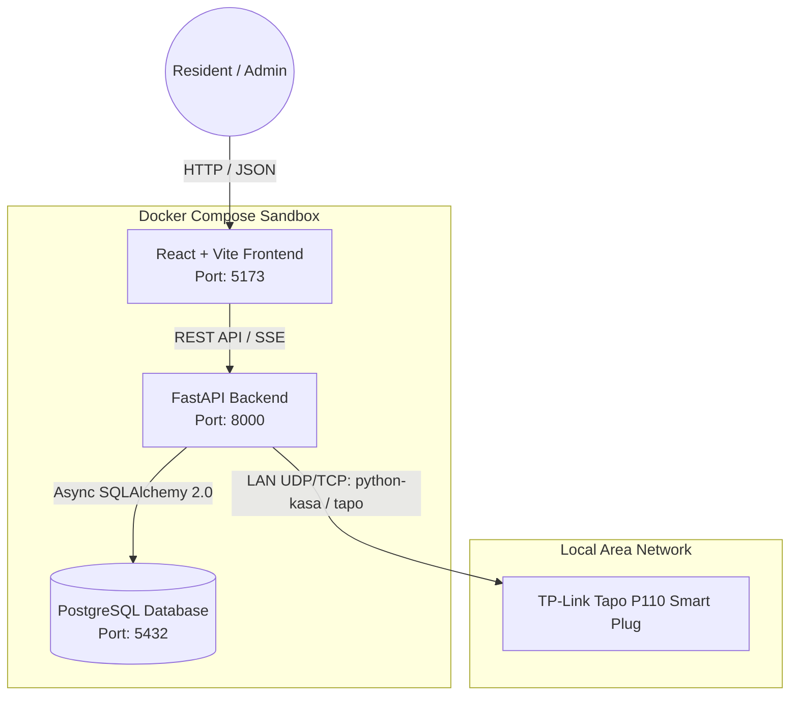
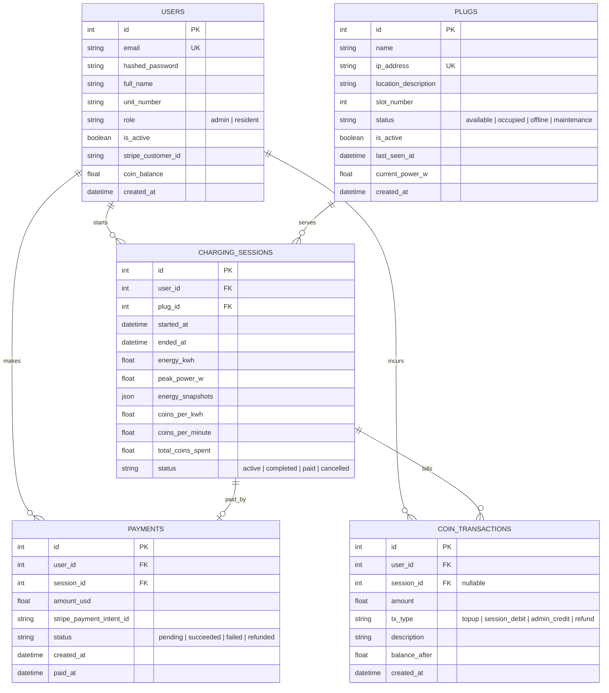
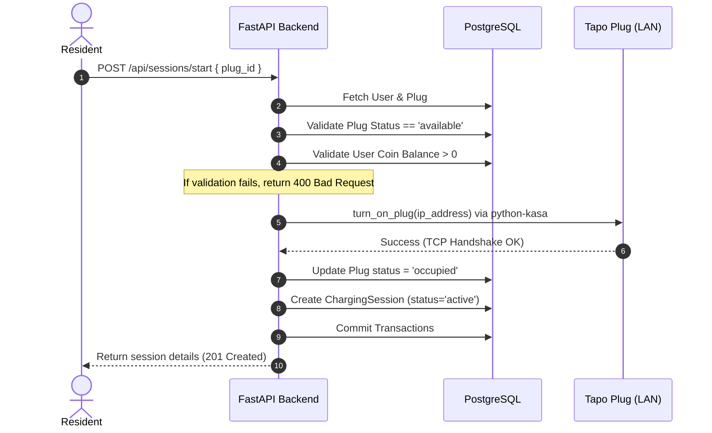
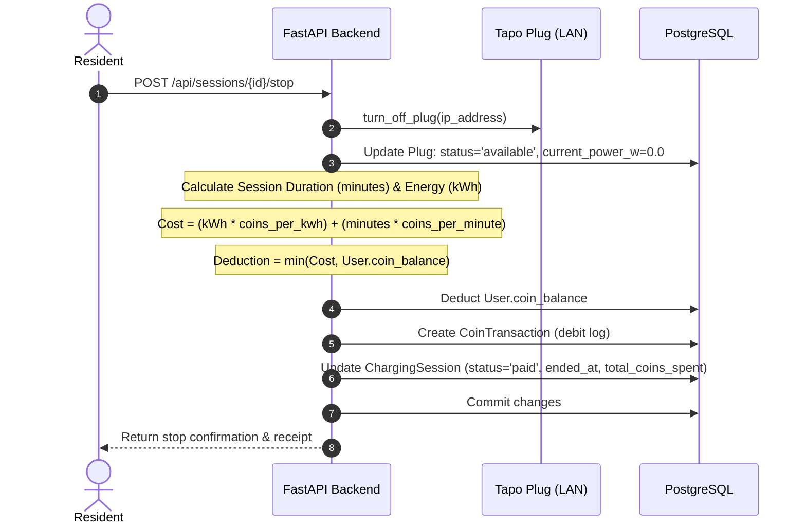
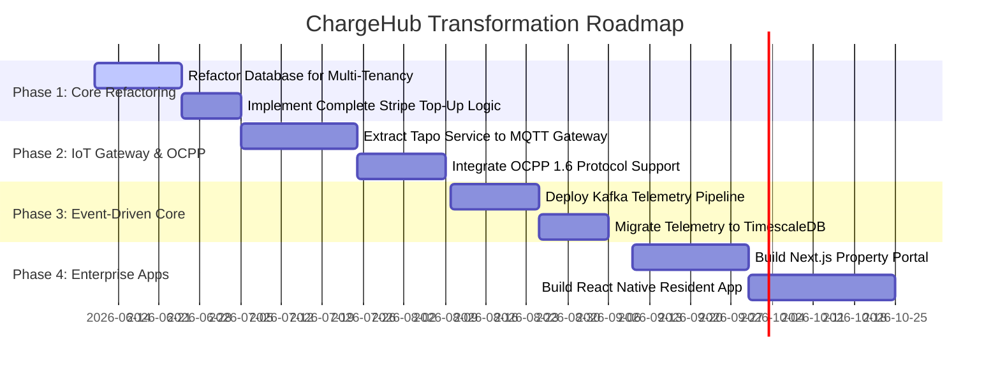

# ChargeHub: Technical Architecture & Enterprise Scaling Guide

This document provides a comprehensive analysis of the current **ChargeHub** EV charging management codebase, details its structural components and operational flows, and maps out a strategic roadmap to scale it into a robust, multi-tenant, enterprise-grade system.

---

## 1. Executive Summary & Core Value Proposition

**ChargeHub** is a local, full-stack EV charging management platform designed for multi-family residential buildings (such as apartment complexes). 

### The Core Problem
Most smart EV charging solutions depend on cloud infrastructure (proprietary APIs, vendor backends, and continuous internet connections). If the internet drops or the manufacturer's cloud service goes offline, charging stops, authentication fails, and billing transactions get lost.

### The ChargeHub Solution
ChargeHub operates **entirely local-first** on the building's Local Area Network (LAN).
- **Direct Hardware Control:** Bypasses vendor clouds by talking directly to cheap, widely available **TP-Link Tapo P110** smart plugs (which feature built-in energy monitoring).
- **Virtual Coin Ledger:** Avoids credit card micro-transaction fees for every charging event by using a local virtual coin wallet.
- **Sleek UX:** Provides a premium, dark-mode, glassmorphic dashboard for residents and a complete administrative control panel.

---

## 2. Current Architecture & Technical Stack

The current implementation is containerized into three primary services managed by `docker-compose.yml`:



### Backend (FastAPI Monolith)
- **Framework:** Python 3.11 with FastAPI. FastAPI's asynchronous support (`async/await`) is utilized for non-blocking network requests.
- **Database Access:** Asynchronous PostgreSQL connections using SQLAlchemy 2.0 (`asyncpg` driver).
- **Session Polling Scheduler:** Built-in `APScheduler` (`AsyncIOScheduler`) running in-process. It polls all active plugs every $N$ seconds (configured by `POLL_INTERVAL_SECONDS`, default 30s) to update power consumption, log telemetry, and verify connectivity.
- **Hardware Integrations:**
  - **`python-kasa`:** Primary library. Communicates with plugs over the LAN, utilizing the KLAP handshake protocol for newer TP-Link firmware.
  - **`tapo`:** Fallback API client.
  - **Mock Plugs:** If Tapo credentials are not configured in `.env`, the system automatically falls back to simulating smart plugs (mocking random current wattage between 1000W and 2400W).

### Frontend (React Single Page Application)
- **Framework:** React 18 with Vite and TypeScript.
- **Styling:** Custom CSS (`index.css`) establishing a dark-theme glassmorphic interface (using semi-transparent card layouts, custom glow styling, and CSS variables). No Tailwind is utilized, preserving performance and layout control.
- **State Management:** React Context (`AuthContext.tsx`) manages authentication state (JWT storage in `localStorage`, roles). Page-level local states handle telemetry polling and UI updates.
- **Visualizations:** `recharts` for rendering active session graphs and user history.
- **Icons:** `lucide-react`.

---

## 3. Database Schema Deep-Dive

ChargeHub's database is structured to support transactional integrity, audit-trail logging, and hardware-software relationships:



### Database Tables:
1. **`users`:** Tracks credential hashes, apartment unit details, authorization roles, and their virtual coin wallets (`coin_balance`).
2. **`plugs`:** Represents the physical hardware. Records the LAN IP address (`ip_address`), live power telemetry (`current_power_w`), and current hardware status.
3. **`charging_sessions`:** Ties a User to a Plug. Captures starting and ending timestamps, accumulated energy (`energy_kwh`), peak wattage, and a JSON log (`energy_snapshots`) tracking telemetry data points `[{ts, watts, kwh_total}]` for visualization. It locks in the billing rates (`coins_per_kwh`, `coins_per_minute`) at the session start.
4. **`coin_transactions`:** Acts as a financial ledger for virtual coin movements (credits and debits), storing `balance_after` to ensure audit integrity.
5. **`payments`:** Tracks external fiat billing transactions (specifically via Stripe) mapping to specific charging sessions or top-ups.

---

## 4. Key Lifecycle & Transaction Flows

### 4.1. Starting a Charging Session
When a resident selects an available plug and clicks "Start Charging":



### 4.2. Telemetry Polling & Auto-Stop (Background Loop)
Every 30 seconds (configurable), the APScheduler executes `poll_active_sessions()`:

```mermaid
loop Every N Seconds
    Scheduler->>DB: Get all active sessions
    Note over Scheduler: If none active, sleep
    loop For each active session
        Scheduler->>Tapo: Get current plug state (is_on, power_w)
        alt Plug Reachable
            Scheduler->>DB: Update Plug live metrics (current_power_w, last_seen_at)
            Scheduler->>DB: Calculate energy delta (power × elapsed_time)
            Scheduler->>DB: Append JSON snapshot & update accumulated energy_kwh
            alt current_power_w < 5.0 W (Charge Complete)
                Note over Scheduler: Increment zero-power read count
                alt Threshold reached (3 reads)
                    Scheduler->>DB: Auto-complete charging (Session status = completed)
                    Note over Scheduler: (Optional) Notify resident
                end
            else
                Note over Scheduler: Reset zero-power read count to 0
            end
        else Plug Offline
            Scheduler->>DB: Mark Plug status = 'offline'
            Note over Scheduler: Keep session active to allow recovery
        end
    end
    Scheduler->>DB: Commit all changes
end
```

### 4.3. Stopping a Charging Session & Settle Bill
When a user stops a session or an admin terminates it:



---

## 5. Architectural Blueprint for an Enterprise, Multilayered Platform

To transition ChargeHub from a single-building prototype into a scalable enterprise SaaS platform capable of managing thousands of charging sites with millions of active plugs, we must decouple its architecture into dedicated logical layers:

```
┌────────────────────────────────────────────────────────────────────────────────────────┐
│                              Mobile & Web Frontend Layer                               │
│  ┌──────────────────────────────┐        ┌──────────────────────────────────────────┐  │
│  │ Resident App (Flutter/React) │        │   Property Management Portal (Next.js)   │  │
│  └──────────────┬───────────────┘        └────────────────────┬─────────────────────┘  │
└─────────────────┼─────────────────────────────────────────────┼────────────────────────┘
                  │                                             │
┌─────────────────┼─────────────────────────────────────────────┼────────────────────────┐
│                 ▼                                             ▼                        │
│                           API Gateway & Security Layer (Kong)                          │
└─────────────────┬─────────────────────────────────────────────┬────────────────────────┘
                  │                                             │
┌─────────────────┼─────────────────────────────────────────────┼────────────────────────┐
│                 ▼                                             ▼                        │
│                                Microservices Layer                                     │
│  ┌──────────────────────────────┐        ┌──────────────────────────────────────────┐  │
│  │    Auth & Tenant Service     │        │          Billing & Ledger Service        │  │
│  └──────────────┬───────────────┘        └────────────────────┬─────────────────────┘  │
│  ┌──────────────┴───────────────┐        ┌────────────────────┴─────────────────────┐  │
│  │       Charging Service       │        │         Analytics & Reporting Service    │  │
│  └──────────────┬───────────────┘        └────────────────────┬─────────────────────┘  │
└─────────────────┼─────────────────────────────────────────────┼────────────────────────┘
                  │                                             │
┌─────────────────┼─────────────────────────────────────────────┼────────────────────────┐
│                 ▼                                             ▼                        │
│                         Event Streaming & Messaging Layer (Kafka)                      │
└─────────────────┬─────────────────────────────────────────────┬────────────────────────┘
                  │                                             │
┌─────────────────┼─────────────────────────────────────────────┼────────────────────────┐
│                 ▼                                             ▼                        │
│                            Hardware Integration (IoT) Layer                            │
│  ┌──────────────────────────────────────────────────────────────────────────────────┐  │
│  │  OCPP 1.6/2.0.1 Central System (Broker / WebSockets)                             │  │
│  └────────────────────────────────────────┬─────────────────────────────────────────┘  │
│  ┌────────────────────────────────────────┴─────────────────────────────────────────┐  │
│  │  Local Edge Gateways (Raspberry Pi / MQTT Broker in Buildings)                   │  │
│  └──────────────────────────────────────────────────────────────────────────────────┘  │
└───────────────────────────────────────────┬────────────────────────────────────────────┘
                                            │
                                  ┌─────────┴─────────┐
                                  ▼                   ▼
                           [ Tapo Plugs ]      [ OCPP Chargers ]
```

### Tier 1: Hardware Integration & IoT Edge Layer
* **The Problem:** The current model communicates directly over TCP/UDP from the central server. In a distributed cloud environment, the server cannot connect to local apartment subnets behind residential NATs.
* **The Solution:** 
  - **MQTT-Based Edge Agent:** Deploy a lightweight Python/Go daemon on a small local device (e.g., Raspberry Pi, home gateway, or low-cost Linux box) in each apartment building.
  - **Functionality:** The local agent polls the local Tapo plugs locally, aggregates metrics, and publishes telemetry messages up to a cloud-based MQTT broker or Kafka cluster using secure TLS. It subscribes to a command topic (e.g., `buildings/building_123/plugs/slot_a1/command`) to receive ON/OFF instructions from the cloud.
  - **OCPP Support:** Implement **Open Charge Point Protocol (OCPP 1.6 / 2.0.1)**. This standardizes communication with dedicated Level 2 and Level 3 commercial EVSE chargers (Tesla Wall Connectors, Wallbox, ChargePoint), making the software hardware-agnostic.

### Tier 2: Event-Driven Telemetry Layer
* **Technology:** **Apache Kafka** or **Redpanda**.
* **Usecase:** Telemetry (current wattage, voltage, RSSI) is high-velocity data. Storing every 10-second ping directly in a relational database like PostgreSQL will lead to write bottlenecks.
* **Architecture:** Edge agents write telemetry straight to a Kafka topic (`charging.telemetry`).
  - A **Telemetry Consuming Service** processes these streams in real-time, calculating energy metrics.
  - A **Timeseries Store** (e.g., ClickHouse, TimescaleDB, or InfluxDB) ingests the stream for analytical reporting.
  - The **Transaction Database** (PostgreSQL) is only updated when a session starts, stops, or changes state, protecting it from high-frequency telemetry writes.

### Tier 3: Core Domain Microservices
Deconstruct the FastAPI monolith into isolated, domain-focused services:
1. **Tenant & Property Service:** Manages multi-tenant boundaries (Buildings, Associations, Resident accounts, Custom Rates per building, and Parking spaces).
2. **Charging & Telemetry Service:** Manages active charging sessions, auto-completion, and command distribution (sending ON/OFF requests to the IoT Layer).
3. **Ledger & Billing Service:** Manages user wallets, records transaction journals, processes credit card charges (via Stripe/Adyen), and manages subscriptions.
4. **Notification Service:** Dispatches real-time push alerts (Firebase Cloud Messaging, WebSockets, SMS, or Emails) when charging completes, a plug goes offline, or a user's wallet is low on coins.

### Tier 4: Enterprise-grade Frontends
* **Resident App (React Native / Flutter / Next.js Web App):**
  - **Features:** Scan QR codes on parking bays to initiate charging, integrate with Apple Pay / Google Pay, check charging speeds, and view cost projections.
* **Property Manager Portal (React/Next.js):**
  - **Features:** Comprehensive dashboards tracking energy consumption, revenue breakdowns, tenant list audits, billing rate adjustment panels, and carbon offset reporting.

---

## 6. High-Impact Enterprise Use Cases & Business Models

By upgrading to a multilayered, multi-tenant architecture, ChargeHub can be deployed across several high-value commercial sectors:

### 6.1. Smart Load Management for Apartment Blocks (HOAs & Condominiums)
* **The Problem:** Older apartment buildings have strict electrical capacity limits. If 15 residents plug in their EVs simultaneously, it can blow the building's main breaker.
* **The Use Case (Dynamic Load Balancing):** 
  - Using real-time telemetry from the IoT layer, the system monitors total energy usage across all plugs.
  - If total demand exceeds a safe threshold (e.g., 80% of capacity), the backend prioritizes charging sessions using a scheduling algorithm (e.g., Round Robin, First-In-First-Charged, or prioritizing vehicles with the lowest battery percentage).
  - Plugs are throttled or cycled on/off to balance the electrical load safely.

### 6.2. Corporate Workspace Fleet & Employee Charging
* **The Use Case:** Corporates install charging plugs in staff parking bays.
* **Billing Adjustments:**
  - Corporate employees authenticate using Single Sign-On (OIDC / OAuth2 via Okta or Google Workspace).
  - **Subsidized Charging:** Employees charge at cost or free during work hours (10:00 AM - 4:00 PM) to utilize building solar capacity, while guests are billed at standard commercial rates.
  - Cost allocation is automatically routed to corporate department budgets.

### 6.3. Logistic Fleets & Depot Scheduling
* **The Use Case:** Last-mile delivery fleets (e.g., Amazon DSPs, local courier services) with dozens of electric vans.
* **Smart Scheduling:**
  - Integrates with delivery route schedules. Plugs are turned on automatically only when a van is scheduled to be parked.
  - Monitors and alerts managers if a vehicle is plugged in but not drawing power, preventing missed shifts due to dead batteries.

### 6.4. Grid Integration (Virtual Power Plants & Demand Response)
* **The Use Case:** Partnering with regional electrical grid utilities.
* **Demand Response:**
  - During peak grid stress (e.g., hot summer afternoons), the utility issues a demand response signal.
  - The ChargeHub platform automatically pauses or reduces power to all active, non-critical resident charging sessions for 1–2 hours.
  - Residents are compensated with free coins/credits, and the property management company receives utility rebates.

---

## 7. Execution Roadmap to Multilayered ChargeHub

Here is the step-by-step technical plan to evolve this project:



### Phase 1: Database & Core Refactoring (Multi-Tenancy)
1. **Add `tenant_id`:** Add a `tenant_id` (foreign key pointing to a new `tenants` or `properties` table) to `users`, `plugs`, and `charging_sessions` to partition data.
2. **Expand Stripe Webhooks:** Refactor the Stripe webhook in `backend/routers/payments.py` to correctly capture `chargehub_topup` events, locate the corresponding user via metadata, and credit their `coin_balance` automatically upon a successful purchase.

### Phase 2: Edge Gateway & Hardware Extension (IoT)
1. **Build the Edge Daemon:** Create a simple Python/Go service that runs locally in a building, uses `python-kasa` to control plugs on the LAN, and talks back to the central backend via a lightweight MQTT client.
2. **Add OCPP Broker:** Setup an OCPP central system router in the backend (using libraries like `ocpp` in Python) to allow standard commercial chargers to connect over WebSockets.

### Phase 3: Telemetry & Event-Streaming (Scaling Data)
1. **Setup Kafka Broker:** Spin up Kafka in docker-compose. Refactor edge gateways to push power metrics to Kafka topics.
2. **Implement Telemetry Consuming Service:** Create a streaming consumer to update active session structures, storing high-resolution charging graphs in a timeseries database (e.g. TimescaleDB).

### Phase 4: Enterprise Frontends & Apps
1. **Property Dashboard:** Build a dashboard using Next.js, displaying building-wide aggregate charging load, revenue, and active system alerts.
2. **Mobile Apps:** Build a cross-platform app for Android/iOS using React Native, including push notification systems to alert users of charge completion.
